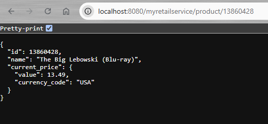

# myRetail RESTful Service 

Internal REST Service to aggregate product data from multiple sources and return it as JSON to the caller.

Prerequisites:
   - Java 17 or later ([Installation Instructions](https://www.oracle.com/java/technologies/downloads/#java21))
   - Gradle 7.5+ ([Installation Instructions](https://gradle.org/install/))
   - MongoDB 8.0+ ([Installation Instructions](https://www.mongodb.com/docs/manual/installation))

Compile/Tested with:
- Java 21
- Gradle 8.11.1
- MongoDB 8.0.4

# Running the Service
Before running, MongoDB must be installed locally. Test data for ids 13860428 and 54456119 will be created and inserted in database on start-up.

Run gradlew via the terminal to start the application: 
`./gradlew bootRun`

Hit GET endpoint on localhost: 
`http://localhost:8080/myretailservice/product/13860428`

Run PUT endpoint on localhost via `src\test\httpClient\putRequest.http` (install REST Client Extension for easilyu running .http files), update current_price.value to be updated in the database: 
`http://localhost:8080/myretailservice/product/13860428`

## Tests
Run tests: `./gradlew test`

# References

- [Spring Data MongoDB](https://docs.spring.io/spring-data/mongodb/reference/index.html)
- [Spring Mongo Data Repositories](https://docs.spring.io/spring-data/mongodb/reference/mongodb/repositories/repositories.html)
- [MongoDB Documentation](https://www.mongodb.com/docs/manual/reference/)
   - [Update Operators](https://www.mongodb.com/docs/manual/reference/operator/update/)
   - [Query Operators](https://www.mongodb.com/docs/manual/reference/operator/query/)

# Local Testing Results:

## Response from GET request

## PUT Request to Update Database

# Containarizing/Docker

- Reference: [Spring Boot Docker](https://spring.io/guides/gs/spring-boot-docker)

Run command for Docker Build: 
`docker build --build-arg JAR_FILE=build/libs/retail-restful-service-1.0.0.jar -t docker/myretail-restful-service . `

Use gradle to build new images:
`./gradlew bootBuildImage --imageName=docker/myretail-restful-service`

## Docker Compose
- [Docker Compose Reference](https://geshan.com.np/blog/2023/03/mongodb-docker-compose/) - MongoDB & Springboot Containers

Create  `docker-compose.yml` with separate container configs, making sure the MongoDB in the Docker file is the same as one specified the `application.properties`

Run `docker-compose up` to start up the containers
Run `docker-compose down` to stop them (or CTR+C)